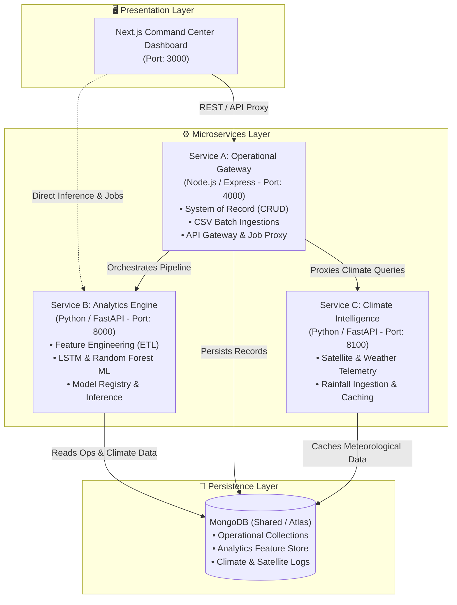

# 🌊 Groundwater Prediction Command Center

[](https://nextjs.org/)
[](https://nodejs.org/)
[](https://fastapi.tiangolo.com/)
[](https://pytorch.org/)
[](https://www.mongodb.com/)
[](https://www.docker.com/)
[](LICENSE)

> **An enterprise-grade, distributed hydrological monitoring and predictive analytics platform.** Designed to bridge operational water table logging with multi-model machine learning forecasting, satellite-derived climate intelligence, and interactive policy simulation.

---

## 📑 Table of Contents

- [Overview](#-overview)
- [System Architecture](#-system-architecture)
- [Key Features](#-key-features)
- [Tech Stack](#-tech-stack)
- [Network & Port Configuration](#-network--port-configuration)
- [Repository Structure](#-repository-structure)
- [Quick Start with Docker](#-quick-start-with-docker)
- [Manual Local Development](#-manual-local-development)
- [Environment Variables](#-environment-variables)
- [Remote & LAN Access](#-remote--lan-access)
- [API Reference](#-api-reference)
- [Machine Learning & Simulation Engine](#-machine-learning--simulation-engine)
- [Author & License](#-author--license)

---

## 🌐 Overview

Groundwater depletion is a critical global challenge demanding proactive resource stewardship. Traditional monitoring systems are often siloed, retrospective, and lack the predictive foresight required for timely intervention.

The **Groundwater Prediction Command Center** is an end-to-end, decoupled microservices solution engineered to:
1. **Record & Ingest:** Track operational well measurements, water levels (mbgl - meters below ground level), and industrial/agricultural extraction logs.
2. **Enrich with Climate Signals:** Ingest satellite telemetry, rainfall metrics, and meteorological parameters.
3. **Forecast Depletion Trends:** Leverage dual ML architectures (**LSTM Neural Networks** & **Random Forest Regressors**) to generate 12-month water table depth forecasts with explainability metrics.
4. **Simulate Policy Interventions:** Provide hydrologists and authorities with an interactive sandbox to test "what-if" scenarios across variable extraction stress and precipitation anomalies.

---

## 🏗 System Architecture

The platform adopts a decoupled microservice architecture ensuring operational logging (OLTP), analytics processing (OLAP/ML), and climate ingestion remain independent and resilient.



### Microservice Roles

| Service | Technology | Role & Responsibilities |
| :--- | :--- | :--- |
| **Frontend** | Next.js 16, React 19, Tailwind CSS 4, Recharts | Interactive GIS-style dashboard, live regional monitoring grid, interactive simulation sandbox, compliance charts, and administrative ingestion tools. |
| **Service A (Operations)** | Node.js, Express (ESM), Mongoose | Acts as the primary OLTP system of record and API gateway for region profiles, monitoring wells, daily water level readings, extraction audits, and proxy orchestration. |
| **Service B (Analytics)** | Python 3.10+, FastAPI, PyTorch, Scikit-Learn | The analytical intelligence engine running automated ETL jobs, lag/rolling feature engineering, model training (LSTM & Random Forest), model registry promotion, and 12-month forecasting. |
| **Service C (Climate)** | Python 3.10+, FastAPI, Motor/Pymongo | Handles meteorological data streams, precipitation ingestions, satellite metric tracking, and climate anomaly feeds. |

---

## 🚀 Key Features

* **Real-Time Operational Monitoring:** Live vital signs displaying active regions, monitored wells, total data points, and critical threshold breaches.
* **Dual Machine Learning Forecasting:** Automated pipeline integrating both **Random Forest** (tabular ensemble) and **LSTM** (recurrent temporal sequence) models to project water depth 12 months ahead.
* **Interactive Hydrological Simulation Lab:** Custom sandbox allowing operators to adjust extraction rates (e.g., +20% agricultural surge or -15% conservation) and climate scenarios to project aquifer resilience.
* **Extraction Auditing & Compliance Tracking:** Continuous logging of water draw volumes against regional legal limits with automatic violation flags.
* **One-Click End-to-End Pipeline:** Automated execution chain from raw CSV ingestion $\to$ daily aggregation ETL $\to$ model retraining $\to$ registry evaluation $\to$ forecast generation.
* **Satellite & Precipitation Ingestion:** Integrates external weather APIs and batch rainfall datasets for environmental correlation.
* **Dockerized & Remote-Ready:** Pre-configured bridge networking and dynamic `HOST_IP` / CORS bindings for seamless local network or cloud deployments.

---

## 🛠 Tech Stack

### Frontend
* **Core:** Next.js 16 (App Router), React 19, TypeScript
* **Styling:** Tailwind CSS 4, PostCSS, Lucide React (Icons)
* **Data Visualization:** Recharts, Date-fns
* **Networking:** Axios, REST Client Utilities

### Backend & Services
* **Service A (Ops & Gateway):** Node.js 20+, Express.js (ES Modules), Mongoose, Multer (CSV handling), Helmet, Morgan, CORS
* **Service B (Analytics):** Python 3.10+, FastAPI, Uvicorn, Pandas, NumPy, Scikit-Learn, PyTorch (LSTM), Joblib
* **Service C (Climate):** Python 3.10+, FastAPI, Motor, Pymongo, Pandas

### Database & Infrastructure
* **Database:** MongoDB 7.0+ (Local Community or MongoDB Atlas Cloud)
* **Containerization:** Docker Engine, Docker Compose (Multi-stage builds)
* **Networking:** Bridge network isolation with internal DNS resolution

---

## 🌐 Network & Port Configuration

| Component | Port | Host URL | Description |
| :--- | :--- | :--- | :--- |
| **Frontend** | `3000` | `http://localhost:3000` | Command Center UI Dashboard |
| **Service A** | `4000` | `http://localhost:4000` | Operations API & Gateway (`/api/v1`) |
| **Service B** | `8000` | `http://localhost:8000` | Analytics & ML Engine (`/jobs/*`, `/health`) |
| **Service C** | `8100` | `http://localhost:8100` | Climate & Satellite API (`/api/v1/*`) |
| **MongoDB** | `27017`| `mongodb://localhost:27017` | Database Instance |

---

## 📁 Repository Structure

```text
groundwater-command-center/
├── docker-compose.yml              # Multi-container orchestration specification
├── .env.example                    # Global environment template
│
├── frontend/                       # Next.js 16 Presentation Layer
│   ├── src/
│   │   ├── app/                    # App router pages (dashboard, regions, simulation, admin)
│   │   ├── components/             # Reusable UI widgets, charts, and control forms
│   │   ├── lib/                    # API client configuration (Service A, B, C)
│   │   └── types/                  # TypeScript interface contracts
│   ├── Dockerfile                  # Production Next.js container configuration
│   └── package.json
│
├── services/
│   ├── service-a-operations/       # Node.js / Express Operational API & Gateway
│   │   ├── src/
│   │   │   ├── config/             # MongoDB database connection
│   │   │   ├── models/             # Mongoose schemas (Region, Well, Reading, Extraction, etc.)
│   │   │   ├── modules/            # Domain controllers, services, and route definitions
│   │   │   ├── app.js              # Express application configuration & proxy routes
│   │   │   └── server.js           # Server bootstrap
│   │   ├── Dockerfile
│   │   └── package.json
│   │
│   ├── service-b-analytics/        # Python / FastAPI Analytics & Machine Learning Engine
│   │   ├── src/
│   │   │   ├── extract/            # Data extraction loaders from MongoDB
│   │   │   ├── transform/          # Time-series feature engineering & lag features
│   │   │   ├── modelling/          # LSTM & Random Forest training, evaluation, explainability
│   │   │   ├── inference/          # 12-month predictive forecasting engine
│   │   │   └── jobs/               # Daily summary and ETL execution routines
│   │   ├── app.py                  # FastAPI background worker & job endpoints
│   │   ├── main.py                 # CLI entry point for scheduled tasks
│   │   ├── Dockerfile
│   │   └── requirements.txt
│   │
│   └── service-c-climate/          # Python / FastAPI Climate & Satellite Ingestion Service
│       ├── src/
│       │   ├── api/                # Endpoints for rainfall, weather, and satellite data
│       │   ├── config/             # Database connection & index provisioning
│       │   └── main.py             # FastAPI entry point
│       ├── Dockerfile
│       └── requirements.txt
│
└── docs/                           # Architecture, ports, and API specifications
```

---

## ⚡ Quick Start with Docker

### Prerequisites
* [Docker Desktop](https://www.docker.com/products/docker-desktop/) (v24.0+)
* [Git](https://git-scm.com/)

### 1. Clone & Configure
```bash
git clone https://github.com/prat-347-ik/groundwater-command-center.git
cd groundwater-command-center
cp .env.example .env
```

<<<<<<< HEAD

2. **Environment Configuration:**
Ensure MongoDB is running locally or update the connection strings in the service configuration files.
3. **Launch with Docker:**
```bash
docker-compose up --build

```

### **Root / Global Configuration**

```env
# --- MongoDB Configuration ---
# Single source of truth for the shared database
[cite_start]MONGO_URI=mongodb://localhost:27017/groundwater_db [cite: 3]

```

### **Frontend (Next.js)**

*File location: `/frontend/.env.local*`

```env
# URL for the Operational API (Service A)
[cite_start]NEXT_PUBLIC_API_URL=http://localhost:8100/api/v1 [cite: 3]

# URL for the Analytics Engine (Service B)
[cite_start]NEXT_PUBLIC_ANALYTICS_URL=http://localhost:5001 [cite: 3]

```

### **Service A: Operations (Node.js)**

*File location: `/services/service-a-operations/.env*`

```env
# Network configuration
[cite_start]PORT=8100 [cite: 3]
[cite_start]NODE_ENV=development [cite: 3]

# Database connection
[cite_start]MONGO_URI=mongodb://localhost:27017/groundwater_db [cite: 3]

```

### **Service B: Analytics Engine (Python)**

*File location: `/services/service-b-analytics/.env*`

```env
# API and Job configuration
[cite_start]SERVICE_B_PORT=5001 [cite: 3]
[cite_start]MODEL_PATH=./models/v1 [cite: 3]
[cite_start]TRAINING_ENABLED=true [cite: 3]

# Database and Adapter links
[cite_start]MONGO_URI=mongodb://localhost:27017/groundwater_db [cite: 3]
[cite_start]SERVICE_A_URL=http://localhost:8100/api/v1 [cite: 3]
[cite_start]SERVICE_C_URL=http://localhost:5002 [cite: 3]

```

### **Service C: Climate Layer (Python)**

*File location: `/services/service-c-climate/.env*`

```env
# Integration settings
[cite_start]SERVICE_C_PORT=5002 [cite: 3]

# External API Keys (Required for satellite data fetching)(Optional)
[cite_start]SATELLITE_API_KEY=your_satellite_provider_key_here [cite: 3]
[cite_start]WEATHER_API_URL=https://api.weather_provider.com/v3 [cite: 3]

# Local DB for climate caching
[cite_start]MONGO_URI=mongodb://localhost:27017/groundwater_db [cite: 3]

```


4. **Access the Services:**
* **Frontend Dashboard:** `http://localhost:3000`
* **Operational API (Service A):** `http://localhost:4000`
* **Analytics API (Service B):** `http://localhost:8000`
* **Climate API (Service C):** `http://localhost:8100`

### Remote Access From Another PC

1. **Find your host machine IP (Windows):**

```powershell
ipconfig
```

Use your active adapter IPv4 address (for example `192.168.1.50`).

2. **Set host IP and CORS origins in root `.env`:**

```env
HOST_IP=192.168.1.50
ALLOWED_ORIGINS=http://localhost:3000,http://192.168.1.50:3000
```

3. **Open firewall inbound ports on the host machine (Windows):**

```powershell
New-NetFirewallRule -DisplayName "Groundwater Frontend 3000" -Direction Inbound -Action Allow -Protocol TCP -LocalPort 3000
New-NetFirewallRule -DisplayName "Groundwater Service A 4000" -Direction Inbound -Action Allow -Protocol TCP -LocalPort 4000
New-NetFirewallRule -DisplayName "Groundwater Service B 8000" -Direction Inbound -Action Allow -Protocol TCP -LocalPort 8000
New-NetFirewallRule -DisplayName "Groundwater Service C 8100" -Direction Inbound -Action Allow -Protocol TCP -LocalPort 8100
```

4. **Rebuild and start:**

=======
### 2. Build & Launch
>>>>>>> 31c15262dd8e57302c7d89f7ecb2f1ae0417f7b1
```bash
docker compose up --build -d
```

<<<<<<< HEAD
5. **Access from a remote PC on the same LAN:**
=======
### 3. Verify Deployment
Open your browser and navigate to:
* **Frontend Command Center:** [http://localhost:3000](http://localhost:3000)
* **Service A Health Check:** [http://localhost:4000/health](http://localhost:4000/health)
* **Service B Health Check:** [http://localhost:8000/health](http://localhost:8000/health)
* **Service C Health Check:** [http://localhost:8100/health](http://localhost:8100/health)
>>>>>>> 31c15262dd8e57302c7d89f7ecb2f1ae0417f7b1

---

<<<<<<< HEAD
6. **Remote access over the internet (choose one):**
* Router port-forwarding for `3000` (and backend ports if direct API access is required).
* Tunneling for testing (no router changes):
=======
## 💻 Manual Local Development
>>>>>>> 31c15262dd8e57302c7d89f7ecb2f1ae0417f7b1

If you prefer running services directly on your host machine without Docker:

### 1. Start MongoDB
Ensure MongoDB is running locally on port `27017` or use a MongoDB Atlas connection string.

### 2. Service A (Operations Layer)
```bash
cd services/service-a-operations
npm install
npm run dev
# Starts on http://localhost:4000
```

<<<<<<< HEAD
7. **Security and deployment notes:**
* Frontend API URLs are generated from `HOST_IP` by `docker-compose.yml`.
* Service A CORS uses `ALLOWED_ORIGINS` (comma-separated allowlist).
* Ensure `MONGO_ATLAS_URI` is valid and reachable from Docker containers.
* Use production mode for remote use. The provided frontend Dockerfile already runs a production build (`next build`) and production server (`next start` via standalone `server.js`).
=======
### 3. Service B (Analytics Engine)
```bash
cd services/service-b-analytics
python -m venv venv
# Windows:
venv\Scripts\activate
# Linux/macOS:
source venv/bin/activate
>>>>>>> 31c15262dd8e57302c7d89f7ecb2f1ae0417f7b1

pip install -r requirements.txt
uvicorn app:app --host 0.0.0.0 --port 8000 --reload
```

### 4. Service C (Climate Layer)
```bash
cd services/service-c-climate
python -m venv venv
# Windows:
venv\Scripts\activate
# Linux/macOS:
source venv/bin/activate

pip install -r requirements.txt
uvicorn src.main:app --host 0.0.0.0 --port 8100 --reload
```

### 5. Frontend Dashboard
```bash
cd frontend
npm install
npm run dev
# Starts on http://localhost:3000
```

---

## ⚙️ Environment Variables

### Root `.env` (Used by Docker Compose)
```env
NODE_ENV=production
MONGO_ATLAS_URI=mongodb://localhost:27017/groundwater_db
DB_NAME_OPS=groundwater_db
DB_NAME_ANALYTICS=groundwater_db
DB_NAME_CLIMATE=groundwater_db

# Host address for remote access (change from localhost if needed)
HOST_IP=localhost
ALLOWED_ORIGINS=http://localhost:3000
```

### Frontend (`frontend/.env.local`)
```env
NEXT_PUBLIC_API_URL_A=http://localhost:4000
NEXT_PUBLIC_API_URL_B=http://localhost:8000
NEXT_PUBLIC_API_URL_C=http://localhost:8100
```

---

## 📡 Remote & LAN Access

To allow other devices or team members on your local network (LAN) to access the dashboard:

1. **Find your Host LAN IP** (e.g., `192.168.1.50` on Windows using `ipconfig` or Linux/macOS using `ifconfig`).
2. **Update the root `.env`:**
   ```env
   HOST_IP=192.168.1.50
   ALLOWED_ORIGINS=http://localhost:3000,http://192.168.1.50:3000
   ```
3. **Ensure Firewall Inbound Rules** permit ports `3000`, `4000`, `8000`, and `8100`.
4. **Rebuild & Start Containers:**
   ```bash
   docker compose up --build -d
   ```
5. **Access from any device on the LAN:**
   ```text
   http://192.168.1.50:3000
   ```

---

## 🔌 API Reference

### Service A — Operations & Gateway (`http://localhost:4000/api/v1`)
* `GET /health` — Service health & gateway status
* `GET /stats/counts` — System-wide totals (regions, wells, readings)
* `GET /regions` — Retrieve all monitored regional zones
* `POST /regions` — Register a new geographical region
* `GET /wells` — Query wells with region filtering
* `POST /water-readings` — Log single or batch water level readings (mbgl)
* `GET /forecasts/:regionId` — Fetch 12-month ML forecast points
* `POST /extraction/logs` — Record regional water extraction events
* `GET /extraction/compliance/:regionId` — Retrieve regional threshold compliance metrics
* `POST /pipeline/trigger` — Proxy trigger to execute Service B analytics pipeline

### Service B — Analytics & ML Engine (`http://localhost:8000`)
* `GET /health` — Analytics engine status & active model metadata
* `POST /jobs/daily-summary` — Trigger asynchronous ETL aggregation
* `POST /jobs/train` — Train Random Forest & LSTM models on feature store
* `POST /jobs/promote` — Evaluate and promote best-performing model to production registry
* `POST /jobs/forecast` — Run batch inference and write 12-month projections to database
* `POST /jobs/pipeline` — Master orchestrator: runs ETL $\to$ Train $\to$ Promote $\to$ Forecast

### Service C — Climate Intelligence (`http://localhost:8100`)
* `GET /health` — Climate service health check
* `GET /api/v1/rainfall/:regionId` — Historical and recent precipitation records
* `POST /api/v1/rainfall/ingest/csv` — Batch ingest rainfall CSV records
* `GET /api/v1/weather/:regionId` — Fetch temperature, humidity, and atmospheric metrics
* `GET /api/v1/satellite/:regionId` — Fetch soil moisture and satellite telemetry

---

## 🧪 Machine Learning & Simulation Engine

### Feature Engineering Pipeline
The platform transforms raw water level logs and weather events into predictive feature representations:
- **Temporal Lags:** $t-1, t-7, t-30$ day water depth variations.
- **Rolling Aggregations:** 7-day and 30-day moving averages and standard deviations.
- **Climate Interaction Features:** Cumulative rainfall deficit indices and seasonal precipitation spikes.

### Interactive Simulation Sandbox
The Simulation Lab allows domain experts to adjust operational variables and view projected aquifer behavior:
$$\text{Projected Depth}_{t+k} = f(\text{Historical Baseline}, \Delta\text{Extraction Rate}, \Delta\text{Precipitation})$$
- **High Stress Scenario:** Simulates severe drought combined with elevated extraction.
- **Conservation Scenario:** Models the impact of mandated extraction reduction targets.

---

## 👨‍💻 Author & License

Developed with passion by **Pratik**  
*Engineering Student & Full-Stack / ML Developer*

This project is licensed under the **MIT License** — see the [LICENSE](LICENSE) file for details.